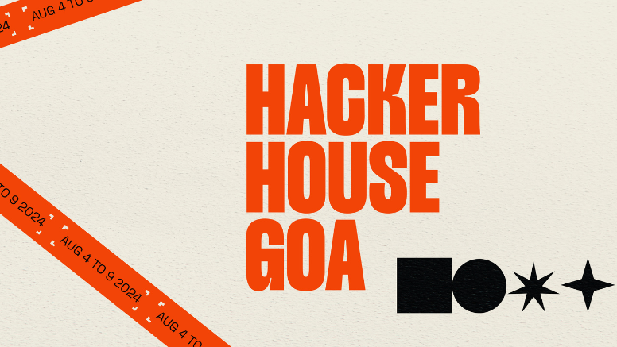

# 🌊 HH Goa 2026 — Builder Identity Generator

> **Generate your Hacker House Goa 2026 branded Builder ID Card or PFP Frame. Upload your photo, download a stunning branded graphic, and share it on X with [#FrameInGoa](https://x.com/search?q=%23FrameInGoa).**



---

## ✨ Features

- 🪪 **Builder ID Card Generator** — Create a personalized Hacker House Goa 2026 ID card with your name, role, GitHub, Twitter, and more
- 🖼️ **PFP Frame Generator** — Overlay the official HH Goa frame on your profile photo
- 📸 **Photo Upload & Crop** — Upload your own photo and position it perfectly on the card
- 🔲 **QR Code & Barcode** — Auto-generated QR and barcode on each card
- ⬇️ **Instant Download** — Download your card as a high-quality PNG in one click
- 🎨 **Goa Ambience** — Immersive animated background that captures the Goa vibe
- 📱 **Fully Responsive** — Works on desktop, tablet, and mobile
- ⚡ **No Login Required** — 100% free, instant, client-side generation

---

## 🛠️ Tech Stack

| Technology | Purpose |
|---|---|
| **React 19** | UI framework |
| **TypeScript** | Type-safe development |
| **Vite 8** | Lightning-fast build tool |
| **Framer Motion** | Smooth animations |
| **Canvas API** | Client-side card rendering |
| **QRCode.js** | QR code generation |
| **JsBarcode** | Barcode generation |
| **Lucide React** | Icon library |
| **Google Fonts** | Premium typography (Cinzel, Space Grotesk, Bodoni Moda) |

---

## 📁 Project Structure

```
hh-goa-builder/
├── public/
│   ├── card-template-clean.png   # ID card background template
│   ├── hhgoa-logo.png            # HH Goa official logo
│   ├── goa-bg.jpg                # Background image
│   ├── devfolio-cover.png        # Social share cover
│   ├── devfolio-favicon.jpeg     # Favicon
│   └── _headers                  # Cloudflare Pages security headers
├── src/
│   ├── components/
│   │   ├── Navbar.tsx            # Navigation bar
│   │   ├── Hero.tsx              # Landing hero section
│   │   ├── StatsBar.tsx          # Community stats display
│   │   ├── HowItWorks.tsx        # Step-by-step guide section
│   │   ├── GeneratorSection.tsx  # Main card/PFP generator UI
│   │   ├── CardCanvas.tsx        # Canvas-based card renderer
│   │   ├── PfpRenderer.tsx       # PFP frame renderer
│   │   ├── GoaAmbience.tsx       # Animated background effects
│   │   ├── MagneticButton.tsx    # Interactive magnetic button
│   │   ├── TiltCard.tsx          # 3D tilt hover effect card
│   │   ├── ScrollReveal.tsx      # Scroll-triggered reveal animations
│   │   ├── Roadmap.tsx           # Event roadmap section
│   │   ├── Community.tsx         # Community/socials section
│   │   └── Footer.tsx            # Site footer
│   ├── hooks/                    # Custom React hooks
│   ├── types/                    # TypeScript type definitions
│   ├── index.css                 # Global styles & design tokens
│   └── App.tsx                   # Root application component
├── index.html                    # HTML entry point with SEO meta tags
├── vite.config.ts                # Vite configuration
├── tsconfig.json                 # TypeScript configuration
└── package.json                  # Dependencies & scripts
```

---

## 🚀 Getting Started

### Prerequisites

- [Node.js](https://nodejs.org/) v18 or higher
- npm v9 or higher

### Installation

```bash
# 1. Clone the repository
git clone https://github.com/MERIL2026/HH.GOA-TASK-1.git

# 2. Navigate to the project directory
cd HH.GOA-TASK-1

# 3. Install dependencies
npm install

# 4. Start the development server
npm run dev
```

The app will be live at **http://localhost:5173**

### Build for Production

```bash
npm run build
```

The production-ready files will be output to the `dist/` folder.

### Preview Production Build

```bash
npm run preview
```

---

## 🎯 How to Use

1. **Visit the site** and scroll to the Generator section
2. **Choose your mode** — Builder ID Card or PFP Frame
3. **Fill in your details** — Name, role, GitHub handle, Twitter handle, etc.
4. **Upload your photo** — Drag & drop or click to browse
5. **Preview your card** in real-time
6. **Click Download** to save as a PNG
7. **Share on X** with **#FrameInGoa** 🌴

---

## 🧩 Components Overview

| Component | Description |
|---|---|
| `GeneratorSection` | Core generator with form inputs and live preview |
| `CardCanvas` | Renders the ID card using HTML Canvas API |
| `PfpRenderer` | Renders the profile picture frame overlay |
| `GoaAmbience` | Animated tropical/Goa-themed background particles |
| `MagneticButton` | Button with magnetic cursor-following hover effect |
| `TiltCard` | 3D perspective tilt effect on hover |
| `ScrollReveal` | Framer Motion powered scroll-triggered animations |
| `HowItWorks` | Three-step visual guide for new users |
| `Roadmap` | Timeline of HH Goa 2026 events |

---

## 🔒 Security

This project implements several security best practices:

- **Content Security Policy** headers via `public/_headers` (Cloudflare Pages)
- **X-Content-Type-Options**: `nosniff`
- **X-Frame-Options**: `DENY`
- **Permissions Policy**: Camera access restricted to same origin only
- **Strict Referrer Policy**: `strict-origin-when-cross-origin`
- All card generation is done **100% client-side** — no data is sent to any server

---

## 📦 Scripts

| Command | Description |
|---|---|
| `npm run dev` | Start development server with hot reload |
| `npm run build` | Type-check and build for production |
| `npm run preview` | Preview the production build locally |
| `npm run lint` | Run oxlint for code quality checks |

---

## 🌐 Deployment

This project is optimized for deployment on **Cloudflare Pages**:

- `public/_headers` file configures security and caching headers
- `vite.config.ts` uses `base: './'` for correct relative asset paths
- Source maps disabled in production for security
- Minification enabled for optimal bundle size

---

## 🤝 Contributing

This project was built for **Hacker House Goa 2026** by the community.

1. Fork the repository
2. Create your feature branch (`git checkout -b feature/amazing-feature`)
3. Commit your changes (`git commit -m 'Add amazing feature'`)
4. Push to the branch (`git push origin feature/amazing-feature`)
5. Open a Pull Request

---

## 📜 License

This project is open source and available under the [MIT License](LICENSE).

---

## 🔗 Explore the Project

🌐 **Live Demo:**  
https://hh-goa-task-1-five.vercel.app/

💻 **Source Code:**  
https://github.com/MERIL2026/HH.GOA-TASK-1

𝕏 **Project on X:**  
https://x.com/MERILPARMAR/status/2087777046688874778?s=20

📸 **Instagram:**  
https://www.instagram.com/meril_parmar_/

🌐 **Developer Portfolio:**  
https://meril-parmar-portfolio.vercel.app/

---

## 🌴 About Hacker House Goa 2026

**Hacker House Goa** is a builder-first community event bringing together developers, designers, and founders to build, learn, and connect in the beautiful backdrop of Goa, India.

- 🐦 Follow on X: [@HackerHouseGoa](https://x.com/HackerHouseGoa)
- 🏷️ Event hashtag: [#FrameInGoa](https://x.com/search?q=%23FrameInGoa)

---

<p align="center">Built with ❤️ by <strong>Aether Labs</strong> for the HH Goa 2026 Builder Community 🌊</p>
